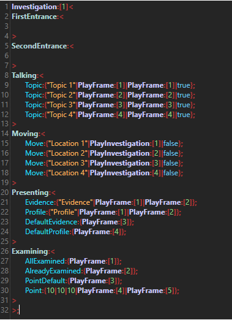

[Back to overview](index.md)

---
# Investigations
---
Investigations are the biggest and most complex feature, so make sure to read the following article carefully to avoid mistakes while using them and prevent unexpected behaviour.

Investigations are annoying to set up as there are many parts, but that's also a bonus. There are a lot of interactions you can set up for a good and "close-to-original" experience.

Let's take a look at the basic script that template is created when using autocomplete (CTRL+T).

As you can see, an Investigation consists of 6 Container Instructions: FirstEntrance, SecondEntrance, Talking, Moving, Presenting and Examining.

Moving, Talking, Presenting, and Examining will be documented in further detail in the chapters below. This page contains information on entrances, how Investigations work in the background, and the best practices when creating Investigations.

# Entrance
**FirstEntrance** contains Regular Instructions that are executed on the first ever entrance to an Investigation sequence. Use this for the green typewriter describing time and place, or for whatever else you might want to do in there.

**SecondEntrance** contains regular Instructions that will be executed on every entrance to an Investigation sequence, including the first one. Use this to set the background and the character on entrance. Be aware that FirstEntrance will be executed BEFORE SecondEntrance (and no, the position in the script doesn't matter).

# Technical
Now, why is it important to know about how Investigations work in the background? Easy: because they may take up more RAM than necessary if done wrong. An Investigation will wait until it's finished to release the RAM it occupies, and it never ends automatically under any circumstance (Exception being the engine crashes). The only way to end an Investigation manually is through the FinishInvestigation Instruction. Furthermore, Investigations are parallel processes, meaning that they run in the background almost independent from the engine itself. This processing requires CPU usage, and, although very small, the effects can be noticed. The problem is that if you execute a PlayInvestigation Instruction for an Investigation you have not yet finished, you will create a completely new sequence. Obviously stuff like first entrance won't be called, but now there are two processes of the same Investigation, but only one of them can actually be controlled. In short, it is wasting CPU usage, RAM space, and there is a chance the engine will ultimately crash because the thread pool can only hold so many threads. 

# Best Practice
How to avoid all that chaos? That and more will be explained by the following best practices:

- Execute a Frame when entering an Investigation sequence that finishes all Investigations that the player can come from. Alternatively, you can swap the [PlayInvestigation](PlayInvestigation.md) Instruction from the [Moving](Moving.md) Hybrid Instruction with a [PlayFrame](PlayFrame.md) Instruction that executes a [PlayInvestigation](PlayInvestigation.md) followed by a [FinishInvestigation](FinishInvestigation.md) of the last Investigation.

- If you want multiple Investigations (locations) in one sequence use the [StartInvestigation](StartInvestigation.md) Instruction and enter the ID of the first Investigation as parameter. This Instruction will execute that Investigation and wait until every Investigation sequence has been finished, even the ones that are not actually part of the current Investigation section. You can simply use the [FinishAllInvestigation](FinishAllInvestigation.md) Instruction to easily end all sequences with one single Instruction and thus move on from the StartInvestigation Instruction.

- Create as few Investigations as possible. If you have gathered a piece of evidence that, for example, unlocks a new topic to talk about with a character, do not create a new Investigation for that. Instead, the best thing would be to have one Investigation per location. Make use of the ability to hide and reveal topics and locations.

- If you don't want a certain option (examining, talking, etc.) to be available in one Investigation sequence, leave the corresponding Container empty. The button for that action will be invisible then.

And now for the actual interactions in the Investigation, choose from the topics below:
- [Moving](Moving.md)
- [Talking](Talking.md)
- [Presenting](Presenting.md)
- [Examining](Examining.md)

---
[Back to overview](index.md)